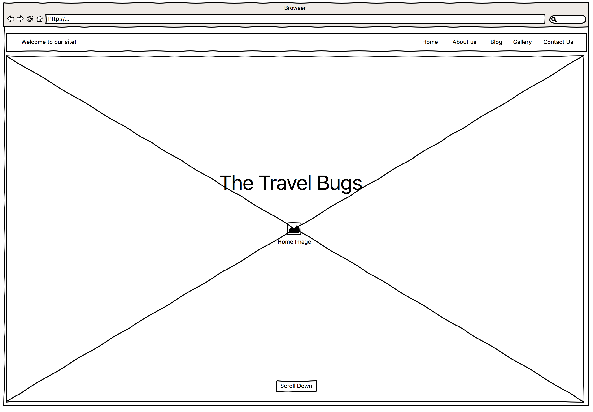
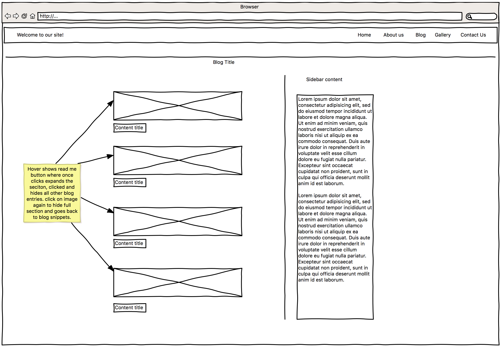
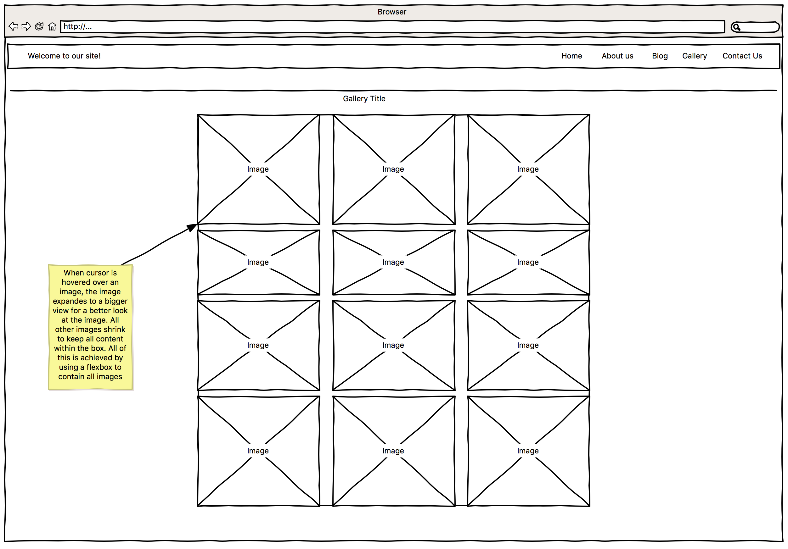
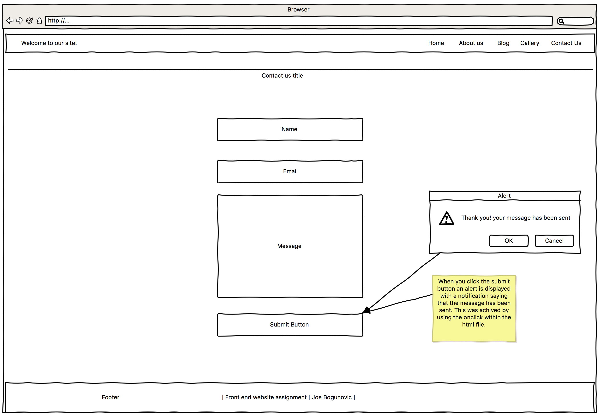

# CTEC3905-Assignment2
Author: Josef Bogunovic P1413098x
 
Project Title: TravelBugs
 
 
PROJECT DESCRIPTION
 
This website was created as a fun project to beneift me and my girlfiend. we both love trevelling and ever since we have been together we have gone to various places as shown within the webiste. Its not all of them but it shows the start of our journey we have been thorugh. THe website opens up of an image of the south side of cyprus (the non turkish side). The photo was taken at one of the highest points of the troodos mountains. THe title is shown clearly on the picture "TravelBugs", the name was chosen because we have caugh a bug, a bug to travel! (i like the pun!). WHen scrollng down you will be an about us section which gives the user a little look into me and jess for you to get t know us that little bit better. There are two pictures which show who we are. THe next seciton is the blog. The blog shows the start of our journey with budapest, it was the first place we went together and one of our most cherished trips. THe picture on the blog for budapest is of the fishermans bastion on the buda side. THe next blog post is cyprus, this was more of a holiday for me as jess has lived there most of her life. The image on the cyprus post is of konnos bay in proteras. THe next post was of paris, we din't do an awful lot here as the plan was only really for disneyland for jesses birthday. THe image is of he mall next to one of the special outlet villages. The final blog post is of course, disneyland. It was honestly a magical place! i met Jafar!.

After the blogs you are met by a gallery which shows some exta pictures of our travells to give the user a bit more to look at than just text. 

** PLEASE NOTE ** 
All images within this website were taken by me, so no images were used off the internet.

sketches are available for design phase within the github directory.

IMPLEMENTATION
 
The website was implemented with the use of a single page webiste, I chose this design over multiple pages because I feel it is a lot cleaner and is easier to look after when working on the project.

Javascript has been widely used within this site. The first instance of javascrpit would be for the h2 under the title, it is used to fade out text and fade in the next text in the sequence, this will keep repeting in a continous loop. Javascript was then used for the smoothscroll animation to give the page a profesional feel to it. 

Jquery UI library was used for the blog post. I implemented the accordion jquery tool to help make the blgo post expand when a user clicks to display more information, this was used to kepe the content of the website simple and clean for easy usability so no one would see lots of text.

The gallery was created with the use of a flexbox and was implemented with only CSS.

The contact us page used a js function to display a popup informing the user that their message has been sent.

PROBLEMS
 
Of course with all websites you are bound to run into some problems. The first problem I encountered was the nav bar was not being responsive even with media queries, after delving into the queries a lot more, it was merely a case that I was not targeting the navbar and was only targeting the section classes to make them responsive. The title on the top of the nav bar is currently out of place and I was unable to make it go over to the left side of the bar. 

My next problem was the about section. I could not figure out the massive gap between my picture and the text in the about secitno which made the socil icons go over the picture of jess's profile.

My final problem is the galery, i couldnt add multiple images via html file, instead i had to do a long winded way by creating a div for each image and keeping the style the same so the gallery would work efficiently (i do apologise)

MISSED FEATURES
 
There was a couple of features I wanted to implement but didnt have time to complete them.

The first feature I wanted to do would of been to add a loading screen animation before the webiste pops up, I feel that this gives a website an incentive to the user that somethig good is loading so they are excited to see the site.

THe final feature I wanted to implement would be a navigation hide/show feature. I did attempt this via javascript but I could not get it to work after many attempts so scrapped it and decided to keep the nav bar at a fixed position.

I hope you enjoyed reading this file and having a look at my webiste and seeing some of my journeys so far. The website will continue to be updated in my spare time as I want to add all of the places I have traveled to as a memento to me to look back at in the future.

							**Sketches**

